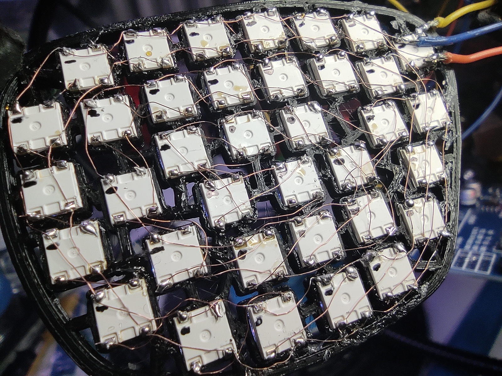
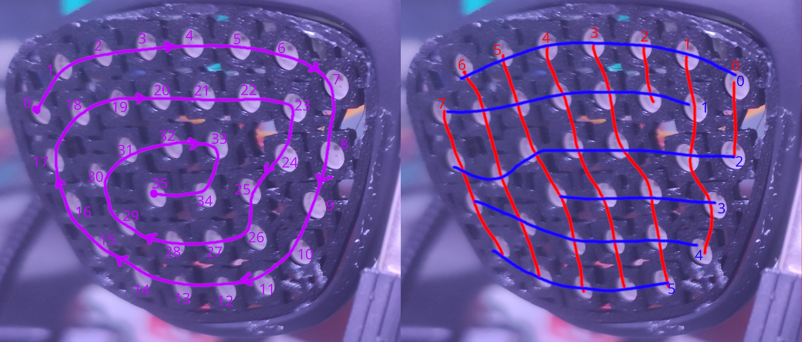

# Glasses v2.0

This is a recreation of an old project. The first version was made out of ordinary LEDs that were being controlled by shift registers. This version uses 2x36 WS2812 LEDs (NeoLEDs).

## Row of LEDs to rows and colmns

The numbering for the rows and columns as seen from the front (from the point of the viewer).

### Left eye

### Right eye
